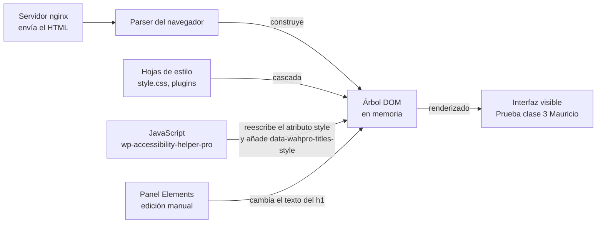
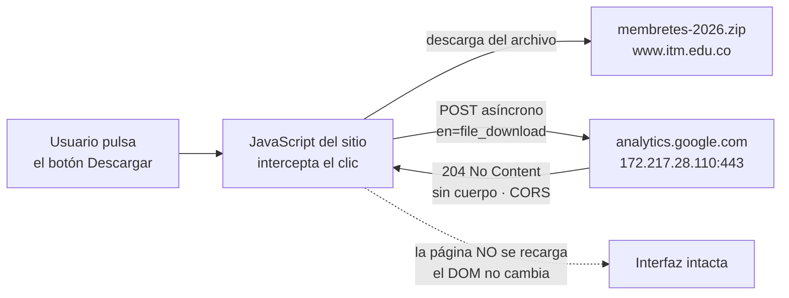
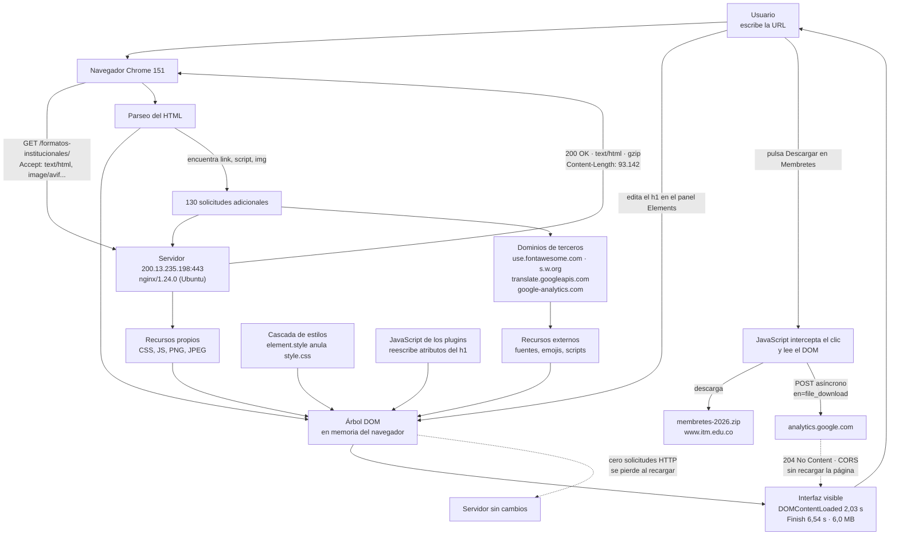

# Laboratorio 01 — Análisis del funcionamiento de una aplicación web

> **Curso:** Aplicaciones y Servicios Web
> **Estudiante:** Mauricio Jojoa
> **Aplicación analizada:** <https://www.itm.edu.co/formatos-institucionales/>
> **Fecha de la observación:** 19 de agosto de 2026, 22:41 (UTC-5) — el encabezado de respuesta reportó `Date: Thu, 20 Aug 2026 03:41:29 GMT`
> **Navegador:** Google Chrome 151.0.7922.138 sobre Windows, resolución 1536×864, idioma `es-co`
> **Herramientas:** paneles **Network** y **Elements** de las herramientas de desarrollo de Chrome, con la opción `Disable cache` activada

---

## Objetivo de la práctica

Analizar el funcionamiento de una aplicación web real mediante las herramientas de desarrollo del navegador, identificando los recursos cargados, las solicitudes y respuestas HTTP, la estructura DOM y las interacciones entre cliente y servidor.

---

# 1. Preparación del entorno

Se ingresó a la aplicación **Formatos Institucionales del ITM** (`https://www.itm.edu.co/formatos-institucionales/`) y se abrieron las herramientas de desarrollo de Chrome, acopladas al lado derecho de la ventana para poder observar simultáneamente la interfaz y los paneles de análisis.

Se trabajó con los paneles **Network** (*Red*) y **Elements** (*Elementos*). En Network se activó la casilla **`Disable cache`**, de modo que todos los tamaños registrados corresponden a bytes realmente transferidos por la red y no a lecturas de la caché local.

Estructura creada en el repositorio:

```text
laboratorio-01/
├── README.md
└── evidencias/
    ├── network.png
    ├── request.png
    ├── dom.png
    └── interaccion.png
```

---

# 2. Identificación de recursos de la aplicación

Con el panel **Network** abierto, el filtro en `All` y la caché deshabilitada, se recargó completamente la aplicación y se registraron todas las solicitudes generadas durante la carga.

## Resultados

Se documentaron **nueve recursos de tipos diferentes** (el mínimo exigido era cinco). Todos los valores provienen de las columnas `Status`, `Domain`, `Type` y `Size` del panel Network:

| Recurso | Tipo | Dominio | Tamaño |
|---|---|---|---|
| `formatos-institucionales/` | Documento HTML | `www.itm.edu.co` | 93.142 B (`Content-Length`, comprimido con gzip) |
| `fa-solid-900.woff2` | Fuente tipográfica (`font`) | `use.fontawesome.com` | 159 kB |
| `back-formatos.jpg` | Imagen JPEG (`jpeg`) | `www.itm.edu.co` | 95,2 kB |
| `flags.png` | Imagen PNG (`png`) | `www.itm.edu.co` | 55,3 kB |
| `wp-emoji-release.min.js?ver=7.0.4` | JavaScript (`script`) | `www.itm.edu.co` | 23,1 kB |
| `supportedLanguages?client=te…` | JavaScript de un tercero (`script`) | `translate.googleapis.com` | 2,8 kB |
| `1f44b.svg` | Imagen vectorial (`svg+xml`) | `s.w.org` | 1,2 kB |
| `log?hasfast=true&authuser=0…` | Baliza de seguimiento (`ping`) | `translate.googleapis.com` | 0,2 kB |
| `collect?v=2&tid=G-MDYJ1KCN…` | Petición asíncrona (`fetch`) | `www.google-analytics.com` | 0,0 kB — respuesta `204` |

**Total de solicitudes observadas:** `131`

### Resumen de la carga (barra inferior del panel Network)

| Métrica | Valor |
|---|---|
| Solicitudes | **131 requests** |
| Bytes transferidos por la red | **6,0 MB transferred** |
| Peso real de los recursos ya descomprimidos | **7,6 MB resources** |
| `DOMContentLoaded` | **2,03 s** |
| `Finish` (última solicitud completada) | **6,54 s** |

La diferencia entre los 6,0 MB transferidos y los 7,6 MB de recursos es consecuencia directa de la compresión: el servidor envía los archivos de texto comprimidos con gzip y el navegador los expande al recibirlos. Se ahorraron aproximadamente **1,6 MB de tráfico**.

También llama la atención que `Finish` (6,54 s) sea muy posterior a `DOMContentLoaded` (2,03 s): la estructura de la página estuvo lista en 2 segundos, pero siguieron llegando recursos durante otros 4,5 segundos.

### Observaciones adicionales de la lista

- **No todas las filas de Network son viajes a la red.** Se registró una fila `data:image/svg+xml;…` cuya columna `Size` indica `(memory cache)` y cuyo tiempo es `0 ms`: es una imagen incrustada directamente en el CSS mediante una *data URI*, por lo que no hubo solicitud HTTP real.
- **Distintos iniciadores producen distintas cadenas de dependencia.** La columna `Initiator` muestra que `back-formatos.jpg`, `u-catedras.png`, `cruz-catedra.png` e `img.png` no los pidió el HTML sino el script `rs6.min.js` (el carrusel Revolution Slider); que `flags.png` lo pidió una hoja de estilos (`style.css?ver=6.0.20`); y que las imágenes de perfil (`graduado-300x300.png`, `empleado-300x300.png`) las pidió `jquery.min.js`.
- **La fuente de FontAwesome no se sirve desde el ITM.** `fa-solid-900.woff2` (159 kB, el recurso individual más pesado de los observados) proviene de `use.fontawesome.com` y fue solicitado por `all.css?ver=7.0.4`.
- **Se observaron numerosas hojas de estilo** en la lista de la evidencia `request.png`: `wppm.frontend.css`, `frontendSelect.min.css`, `font-awesome.min.css`, `jquery-ui.min.css`, `sexySelect.min.css`, `resetFrontend.min.css`, `frontend.min.css`, `all.css`, `front.min.css`, `front-dark.min.css`, `wpdm-modal.min.css`, `style.css`, `toolbar.css`, `wp-accessibility-helper.min.css`, `styles.css`, además de dos hojas externas `css?family=Montserrat:400,700…` y `css?family=Montserrat:300,400…` servidas por Google Fonts.

## Evidencia


**Qué se observa en la captura:** el panel Network con las columnas `Name`, `Status`, `Domain`, `Type`, `Initiator`, `Size` y `Time`, y la barra inferior con el resumen `131 requests · 6.0 MB transferred · 7.6 MB resources · Finish 6.54 s · DOMContentLoaded 2.03 s`.

**Qué significa:** confirma que el navegador no descargó "una página", sino 131 recursos independientes procedentes de varios dominios distintos, cada uno con su propio código de estado, tamaño y tiempo.

**Cómo se relaciona con el funcionamiento de la aplicación:** el sitio está construido sobre un gestor de contenidos con múltiples complementos —las rutas `wp-content/plugins/…` visibles en la lista corresponden a más de una decena de ellos— y cada complemento aporta sus propias hojas de estilo y scripts. Ese es el origen del volumen de solicitudes.

### Análisis

**¿Por qué una sola URL puede generar múltiples solicitudes HTTP?**

> Porque el documento HTML que devuelve el servidor no contiene la página terminada: contiene **referencias** a los demás recursos que la componen. Cuando el navegador analiza (*parsea*) ese HTML y encuentra etiquetas como `<link rel="stylesheet">`, `<script src>` o ``, emite una **nueva solicitud HTTP independiente por cada una**. En esta aplicación, una única URL escrita por el usuario derivó en 131 solicitudes.
>
> Además, no todas las solicitudes las origina el HTML directamente. La columna `Initiator` del panel Network permitió comprobar tres orígenes distintos:
>
> 1. **El propio documento HTML**, que declara sus hojas de estilo y scripts.
> 2. **Otros recursos ya descargados.** La hoja `all.css?ver=7.0.4` pidió a su vez la fuente `fa-solid-900.woff2`, y `style.css?ver=6.0.20` pidió la imagen `flags.png`. Son solicitudes de segundo nivel que el navegador solo puede descubrir después de descargar y procesar el archivo que las contiene.
> 3. **JavaScript en ejecución.** Los scripts `rs6.min.js` y `jquery.min.js` solicitaron imágenes en tiempo de ejecución, y `analytics.js` generó peticiones `xhr` y `fetch` hacia Google Analytics.
>
> En síntesis: **una URL identifica un documento, no una página completa.** La página es el resultado de ensamblar ese documento con todos los recursos que él declara, más los que esos recursos declaran a su vez, más los que el JavaScript decida pedir mientras se ejecuta.

---

# 3. Análisis de una solicitud HTTP

Se seleccionó en Network la primera solicitud de la lista, la correspondiente al **documento principal** (`formatos-institucionales/`), y se inspeccionó su pestaña `Headers`.

## Resultados

| Elemento | Resultado |
|---|---|
| URL | `https://www.itm.edu.co/formatos-institucionales/` |
| Método HTTP | `GET` |
| Código de estado | `200 OK` |
| Host / dominio | `www.itm.edu.co` — dirección remota `200.13.235.198:443` |
| Tipo de recurso | Documento — `Content-Type: text/html; charset=UTF-8` |
| Tiempo de respuesta | `DOMContentLoaded` a los **2,03 s** y `Finish` a los **6,54 s**, según la barra de resumen del panel |

### Encabezados de respuesta observados

| Encabezado | Valor |
|---|---|
| `Server` | `nginx/1.24.0 (Ubuntu)` |
| `Content-Type` | `text/html; charset=UTF-8` |
| `Content-Encoding` | `gzip` |
| `Content-Length` | `93142` |
| `Connection` | `keep-alive` |
| `Date` | `Thu, 20 Aug 2026 03:41:29 GMT` |
| `Link` | `<https://www.itm.edu.co/wp-json/>; rel="https://api.w.org/"` |
| `Link` | `<https://www.itm.edu.co/wp-json/wp/v2/pages/70700>; rel="alternate"; title="JSON"; type="application/json"` |
| `Link` | `<https://www.itm.edu.co/?p=70700>; rel=shortlink` |

### Otros datos de la solicitud

| Elemento | Valor |
|---|---|
| Dirección IP del servidor | `200.13.235.198`, puerto `443` |
| Puerto 443 | Indica **HTTPS**: la comunicación viaja cifrada con TLS |
| `Referrer Policy` | `strict-origin-when-cross-origin` |
| `Accept` (encabezado de petición) | `text/html,application/xhtml+xml,application/xml;q=0.9,image/avif,image/webp,image/apng,*/*;q=0.8,application/signed-exchange;…` |

El encabezado `Accept` es especialmente ilustrativo: el navegador **declara de antemano** qué formatos es capaz de procesar y con qué preferencia (los valores `q=` son pesos de 0 a 1). No se limita a pedir un recurso, sino que negocia con el servidor el formato en que desea recibirlo.

## Flujo observado en esta solicitud

```mermaid
sequenceDiagram
    participant N as Navegador Chrome 151
    participant S as Servidor 200.13.235.198:443<br/>nginx/1.24.0 (Ubuntu)
    N->>S: GET /formatos-institucionales/
    Note over N,S: Accept: text/html, image/avif, image/webp...
    S-->>N: 200 OK · text/html; charset=UTF-8
    Note over N,S: Content-Encoding: gzip · Content-Length: 93142
    N->>N: descomprime y parsea el HTML
    Note over N: DOMContentLoaded a los 2,03 s
    N->>S: 130 solicitudes adicionales
    Note over N: Finish a los 6,54 s · 6,0 MB transferidos
```

## Evidencia


**Qué se observa en la captura:** la pestaña `Headers` de la solicitud del documento principal, con la sección `General` desplegada (`Request URL`, `Request Method: GET`, `Status Code: 200 OK`, `Remote Address: 200.13.235.198:443`) y la sección `Response Headers` mostrando `Server: nginx/1.24.0 (Ubuntu)`, `Content-Encoding: gzip`, `Content-Length: 93142`, `Content-Type: text/html; charset=UTF-8` y los tres encabezados `Link`.

**Qué significa:** el navegador pidió un único documento mediante `GET` y el servidor respondió correctamente con HTML comprimido, transferido de forma cifrada por el puerto 443.

**Cómo se relaciona con el funcionamiento de la aplicación:** este documento es el punto de partida de todo lo demás. Hasta que no llega y se parsea, el navegador ni siquiera sabe qué otros 130 recursos debe pedir. Por eso la página no puede empezar a construirse antes de que esta primera respuesta esté completa.

### Análisis

**¿Qué recurso solicitó el navegador?**

> Solicitó el **documento HTML** de la página *Formatos Institucionales*, mediante `GET https://www.itm.edu.co/formatos-institucionales/`. El servidor lo devolvió con `Content-Type: text/html; charset=UTF-8`, comprimido con gzip: `Content-Length` indica que viajaron **93.142 bytes** por la red.
>
> No se trata de un archivo estático guardado en disco con ese nombre. Los tres encabezados `Link` de la respuesta lo delatan: exponen `wp-json/wp/v2/pages/70700` y `?p=70700`, es decir que el servidor **generó** ese HTML a partir de un contenido identificado internamente con el número **70700**. La URL legible `/formatos-institucionales/` es una dirección amigable que el servidor traduce a ese identificador interno.

**¿Qué información permite determinar si la solicitud fue atendida correctamente?**

> Principalmente el **código de estado**: `200 OK` indica que el servidor entendió la petición, la procesó y devolvió el recurso solicitado. Los códigos `4xx` señalarían un error atribuible al cliente (por ejemplo `404` si la ruta no existiera) y los `5xx` un fallo del servidor.
>
> Sin embargo, el código por sí solo no basta. En la evidencia se verificaron además:
>
> - que `Content-Type` fuera `text/html`, es decir que el contenido recibido es del tipo esperado y no una página de error;
> - que `Content-Length` (93.142 B) coincidiera con los bytes efectivamente recibidos, o sea que la respuesta llegó completa y no truncada;
> - que el navegador realmente construyera el DOM esperado, confirmado por el evento `DOMContentLoaded` registrado a los 2,03 s;
> - que la página se renderizara con su contenido real, visible en la propia captura.
>
> Conviene precisar que un `200 OK` puede acompañar perfectamente a una página que muestra un mensaje de error de la aplicación: el código describe el éxito de la **transacción HTTP**, no la corrección del contenido. Es condición necesaria pero no suficiente.

---

# 4. Inspección del DOM

## Resultados

**Elemento seleccionado:** `Título principal de la página`

**Etiqueta HTML:** `<h1 class="vc_custom_heading vc_do_custom_heading">`

**Contenido original:** `Formatos Institucionales`

**Modificación realizada:** `Prueba clase 3 Mauricio`

### Ubicación del elemento en el árbol DOM

La ruta que muestra la barra inferior del panel Elements termina en `div.wpb_wrapper > h1.vc_custom_heading.vc_do_custom_heading`. La jerarquía completa observada es:

```text
div.vc_row.wpb_row.vc_row-fluid
└── div.wpb_column.vc_column_container.vc_col-sm-12
    └── div.vc_column-inner
        └── div.wpb_wrapper
            ├── div.vc_empty_space (height: 50px)
            ├── h1.vc_custom_heading.vc_do_custom_heading   ← elemento intervenido
            ├── div.vc_empty_space (height: 10px)
            ├── div.vc_separator.vc_sep_width_100
            └── div.wpb_text_column
```

### Estado del elemento

**Nodo en el DOM vivo, ya modificado desde el panel Elements:**

```html
<h1 style="font-size: 35px; color: rgb(99, 0, 221); line-height: 2rem; text-align: center;"
    class="vc_custom_heading vc_do_custom_heading"
    data-wahpro-titles-style="font-size: 35px; color: rgb(99, 0, 221); line-height: 2rem; text-align: center;">Prueba clase 3 Mauricio</h1>
```

### Hallazgo: el DOM no coincide con el HTML que envía el servidor

El panel `Styles` de la evidencia revela una diferencia que **no** fue provocada por la intervención manual. El bloque `element.style` —los estilos aplicados directamente sobre el elemento— contiene:

```css
element.style {
    font-size: 35px;
    color: rgb(99, 0, 221);
    line-height: 2rem;
    text-align: center;
}
```

Sin embargo, el HTML que el servidor envía declara ese mismo atributo con **otros valores**: `font-size: 2.2rem` y `color: #6300dd`. La conversión de `2.2rem` a `35px` y de `#6300dd` a `rgb(99, 0, 221)`, junto con el atributo `data-wahpro-titles-style` —que no existe en el HTML de origen— los introdujo en tiempo de ejecución el complemento de accesibilidad `wp-accessibility-helper-pro`, cuyos archivos se observaron en la carga.

| Atributo | HTML enviado por el servidor | DOM vivo en el navegador |
|---|---|---|
| `style` → `font-size` | `2.2rem` | `35px` |
| `style` → `color` | `#6300dd` | `rgb(99, 0, 221)` |
| `data-wahpro-titles-style` | *no existe* | presente |

Es decir: **el DOM es el resultado del HTML recibido más todas las modificaciones que el JavaScript le aplica después.** Lo que muestra el panel Elements nunca es el archivo original, sino el estado actual del árbol en memoria.

### Cascada de estilos observada

El panel `Styles` muestra además varias reglas **tachadas**, es decir declaradas pero anuladas por otra de mayor prioridad:

| Regla | Origen | Estado |
|---|---|---|
| `element.style { font-size: 35px; … }` | Atributo `style` del elemento | **Aplicada** |
| `.nd_options_customizer_fonts h1 { color: #141e5d; }` | `formatos-in…onales/:242` | Tachada |
| `.vc_do_custom_heading { margin-bottom: 0.625rem; margin-top: 0; }` | `formatos-in…nales/:1147` | Tachada |
| `h1 { font-size: 2.2rem; line-height: 2.4rem; font-weight: bold; }` | `style.css?ver=7.0.4:68` | Tachada |

Esto ilustra el mecanismo de la **cascada** de CSS: los estilos en línea (`element.style`) tienen mayor especificidad que cualquier regla de hoja de estilos, por lo que anulan el `font-size: 2.2rem` declarado en `style.css`.

### Proceso observado



## Evidencia


**Qué se observa en la captura:** el panel Elements con el nodo `h1.vc_custom_heading.vc_do_custom_heading` resaltado y su texto ya sustituido por `Prueba clase 3 Mauricio`; a la izquierda, el título de la página mostrando ese mismo texto en la interfaz; a la derecha, el panel `Styles` con el bloque `element.style` y las reglas tachadas.

**Qué significa:** el cambio se reflejó de inmediato en pantalla, sin recargar la página y sin generar ninguna solicitud HTTP nueva.

**Cómo se relaciona con el funcionamiento de la aplicación:** demuestra que lo que el usuario ve no es el archivo del servidor, sino el DOM renderizado, una estructura que vive **únicamente en la memoria del navegador** y que puede diferir del origen tanto por acción del JavaScript del sitio como por intervención manual.

### Análisis

**¿La modificación realizada sobre el DOM alteró permanentemente la aplicación o los archivos almacenados en el servidor? Justifique.**

> **No.** La modificación fue estrictamente local y temporal.
>
> La razón está en la separación entre cliente y servidor. El navegador no recibió el contenido original sino una **copia** del HTML, y con ella construyó un árbol DOM en su propia memoria RAM. El panel Elements opera sobre ese árbol en memoria, no sobre el origen.
>
> Hay tres comprobaciones que lo respaldan:
>
> 1. **No se generó tráfico de red.** Durante la edición, el panel Network no registró ninguna solicitud nueva. Si el cambio hubiera viajado al servidor, tendría que existir necesariamente una solicitud HTTP de escritura (`POST`, `PUT` o `PATCH`) que la transportara — y no la hubo.
> 2. **El servidor sigue enviando el texto original.** Al volver a solicitar la misma URL, el HTML devuelto conserva `Formatos Institucionales`; en ningún momento aparece `Prueba clase 3 Mauricio`.
> 3. **El cambio no sobrevive a una recarga.** Basta pulsar `F5` para que el navegador descarte el DOM modificado y construya uno nuevo desde el HTML del servidor.
>
> Además, una modificación real requeriría **autenticación**: el servidor no acepta escrituras anónimas sobre su contenido. Las herramientas de desarrollo no eluden ese control, simplemente no lo tocan.
>
> Consecuencia práctica: editar el DOM sirve para probar y depurar la interfaz —por ejemplo, ver cómo quedaría un título más largo antes de pedir el cambio—, pero **no es una forma de alterar un sitio web ajeno**. El cambio desaparece con una recarga y ningún otro usuario lo ve jamás.

---

# 5. Análisis de una interacción dinámica

Se limpió el registro de Network y se ejecutó una acción real dentro de la aplicación: **pulsar el botón `Descargar` de la sección "Membretes"**.

## Resultados

| Elemento | Resultado |
|---|---|
| Acción realizada | Clic en el botón `Descargar` correspondiente al bloque **Membretes** |
| ¿Generó una nueva solicitud? | **Sí** |
| URL solicitada | `https://analytics.google.com/g/collect?v=2&tid=G-B94JQ2LRPV&…&en=file_download&ep.link_url=https%3A%2F%2Fwww.itm.edu.co%2Fwp-content%2Fuploads%2Fformatos%2Fmembretes-2026.zip&…` |
| Método HTTP | `POST` |
| Código de estado | `204 No Content` |
| Tipo de respuesta | Sin cuerpo (`204`); tipo de petición `fetch`, dirección remota `172.217.28.110:443` |

### Parámetros que viajaron en la solicitud

La URL de la petición codifica el evento completo. Decodificados, los parámetros más relevantes son:

| Parámetro | Valor | Qué representa |
|---|---|---|
| `en` | `file_download` | Nombre del evento registrado |
| `ep.link_url` | `https://www.itm.edu.co/wp-content/uploads/formatos/membretes-2026.zip` | Archivo que el usuario descargó |
| `ep.link_text` | `Descargar` | Texto del botón pulsado |
| `ep.file_name` | `/wp-content/uploads/formatos/membretes-2026.zip` | Ruta del archivo en el servidor |
| `ep.file_extension` | `zip` | Extensión del archivo |
| `dl` | `https://www.itm.edu.co/formatos-institucionales/` | Página desde la que se hizo clic |
| `dt` | `Formatos Institucionales – ITM` | Título de esa página |
| `tid` | `G-B94JQ2LRPV` | Identificador de la propiedad de analítica |
| `sr` | `1536x864` | Resolución de pantalla del usuario |
| `ul` | `es-co` | Idioma configurado en el navegador |
| `uafvl` | `Google Chrome 151.0.7922.138 · Chromium 151.0.7922.138` | Versión exacta del navegador |
| `uap` / `uapv` | `Windows` / `19.0.0` | Sistema operativo |

### Encabezados de respuesta observados

| Encabezado | Valor |
|---|---|
| `Access-Control-Allow-Credentials` | `true` |
| `Access-Control-Allow-Origin` | `https://www.itm.edu.co` |
| `Alt-Svc` | `h3=":443"; ma=2592000, h3-29=":443"; ma=2592000` |

Los dos primeros son encabezados **CORS**. Su presencia confirma que se trata de una petición **entre dominios distintos**: el navegador, por su política de mismo origen, solo permite que una página de `www.itm.edu.co` reciba la respuesta de `analytics.google.com` si ese servidor autoriza explícitamente ese origen. El valor `Access-Control-Allow-Origin: https://www.itm.edu.co` es esa autorización.

### Por qué `204 No Content`

El código `204` significa que el servidor procesó la petición correctamente pero **no devuelve ningún cuerpo**. Es coherente con la finalidad de la solicitud: el navegador no espera datos de vuelta, solo necesita entregar la información del evento. La columna `Size` del panel Network lo confirma con `0.0 kB`.

### Comprobación del resultado visible

Al margen de la telemetría, la acción cumplió su propósito aparente: el archivo `membretes-2026.zip` quedó efectivamente guardado en la carpeta de descargas del equipo, con un tamaño de **330.024 bytes**.

Esto permite afirmar que **un solo clic desencadenó dos solicitudes hacia destinos distintos**: la descarga del archivo desde `www.itm.edu.co`, que el usuario sí esperaba, y el envío del evento `file_download` a `analytics.google.com`, del que no recibió ningún indicio en la interfaz.

## Ciclo de interacción observado



## Evidencia


**Qué se observa en la captura:** el panel Network tras la interacción, con la solicitud `collect` hacia `analytics.google.com` seleccionada y su pestaña `Headers` desplegada, mostrando la `Request URL` completa con el evento `en=file_download` y el archivo `membretes-2026.zip`, el `Request Method: POST`, el `Status Code: 204 No Content` y los encabezados CORS de la respuesta.

**Qué significa:** la acción del usuario se tradujo en una solicitud HTTP concreta y verificable, dirigida a un **dominio de terceros**, que transporta información detallada sobre lo que el usuario acaba de hacer.

**Cómo se relaciona con el funcionamiento de la aplicación:** revela una capa de comportamiento que la interfaz no anuncia. El usuario cree estar simplemente descargando un archivo del ITM; en paralelo, el navegador envía a Google el nombre del archivo, el texto del botón, la página de origen, su resolución de pantalla, su idioma, su sistema operativo y la versión de su navegador. Nada de eso es visible sin abrir las herramientas de desarrollo.

### Análisis

**Explique la relación entre la acción realizada por el usuario y la solicitud observada.**

> La relación es de **causa directa**, mediada por el JavaScript de la página.
>
> 1. El usuario pulsó el botón `Descargar` del bloque *Membretes*. Ese botón es un enlace hacia el archivo `membretes-2026.zip` alojado en `www.itm.edu.co`.
> 2. Antes de que el enlace se siguiera, **un script del sitio interceptó el clic**. Lo prueban los parámetros de la solicitud: `ep.link_text=Descargar` y `ep.link_url=…membretes-2026.zip` solo pueden conocerse leyendo el elemento del DOM sobre el que se hizo clic, algo que únicamente el JavaScript en ejecución puede hacer.
> 3. Ese script construyó un evento llamado `file_download`, lo serializó como parámetros y lo envió mediante `POST` a `analytics.google.com`.
> 4. El servidor de Google respondió `204 No Content`: recibido y procesado, sin datos de vuelta.
>
> El punto clave es que esta solicitud es **asíncrona**. A diferencia de lo que ocurriría al enviar un formulario tradicional, aquí:
>
> - la página **no se recargó**;
> - la URL de la barra de direcciones **no cambió**;
> - el DOM **no se modificó**;
> - el usuario **no percibió absolutamente nada**.
>
> Ese es exactamente el mecanismo que distingue una aplicación web moderna de un sitio estático: el JavaScript puede comunicarse con servidores en segundo plano mientras la interfaz permanece intacta. Aquí ese mecanismo se emplea para telemetría, pero es el mismo que permite guardar un formulario sin recargar, cargar más resultados al desplazarse o validar un usuario mientras se escribe.
>
> Cabe señalar una asimetría interesante: la acción del usuario tenía como objetivo obtener un archivo **del ITM**, pero la solicitud capturada va dirigida a **un tercero**. La interacción generó tráfico hacia un destino que el usuario nunca eligió.

---

# 6. Reconstrucción del flujo observado

Diagrama construido a partir de las evidencias recogidas en esta práctica. Reúne los tres caminos que efectivamente se comprobaron: la carga inicial, la edición local del DOM y la interacción asíncrona con un tercero.



**Lectura del diagrama:** las líneas continuas representan el flujo principal comprobado en las evidencias. Las líneas punteadas marcan los dos casos límite que la práctica permitió distinguir: una acción del usuario que **no** genera tráfico ni persiste (la edición del DOM), y una que genera tráfico hacia un tercero **sin** recargar la página ni alterar la interfaz (la telemetría del evento `file_download`).

---

# 7. Observado vs. inferido

## Elementos observados directamente

- **El total de 131 solicitudes HTTP** de la carga inicial, junto con los 6,0 MB transferidos, los 7,6 MB de recursos, el `DOMContentLoaded` a los 2,03 s y el `Finish` a los 6,54 s, todos leídos en la barra de resumen del panel Network.
- **El nombre, código de estado, dominio, tipo, iniciador, tamaño y tiempo de cada recurso individual**, listados uno a uno en las columnas del panel.
- **Los encabezados de la respuesta del documento principal**: `Server: nginx/1.24.0 (Ubuntu)`, `Content-Type: text/html; charset=UTF-8`, `Content-Encoding: gzip`, `Content-Length: 93142`, `Connection: keep-alive` y los tres encabezados `Link`. El software del servidor web es un dato observado porque el propio servidor lo declara en su respuesta.
- **La dirección IP del servidor**, `200.13.235.198`, y su puerto `443`.
- **La estructura del DOM** y la ruta completa hasta el elemento `h1.vc_custom_heading.vc_do_custom_heading`.
- **Que el DOM difiere del HTML recibido**: el bloque `element.style` muestra `font-size: 35px` y `color: rgb(99, 0, 221)` donde el HTML de origen declara `2.2rem` y `#6300dd`, además del atributo `data-wahpro-titles-style` que no existe en el origen.
- **Que existen reglas CSS anuladas por la cascada**, visibles tachadas en el panel `Styles`.
- **Que la edición del `h1` no generó ninguna solicitud HTTP** ni alteró el HTML que el servidor sigue enviando.
- **Que pulsar `Descargar` generó un `POST` a `analytics.google.com` con respuesta `204 No Content`**, y los parámetros exactos que transportó (`en=file_download`, `ep.file_name`, `ep.link_text`, `sr=1536x864`, `ul=es-co`, versión del navegador y sistema operativo).
- **Que esa petición fue autorizada mediante CORS**, por los encabezados `Access-Control-Allow-Origin: https://www.itm.edu.co` y `Access-Control-Allow-Credentials: true`.
- **Que la aplicación depende de dominios de terceros** — `use.fontawesome.com`, `s.w.org`, `translate.googleapis.com`, `www.google-analytics.com`, `analytics.google.com` — para recursos que forman parte de su presentación y funcionamiento.

## Elementos inferidos

- **Que el sitio funciona sobre WordPress.** Ninguna respuesta lo declara. Se deduce de indicios observables: las rutas `wp-content/`, `wp-includes/` y `wp-json/`, los scripts `wp-emoji-release.min.js` y `wp-accessibility-helper.min.js`, y el identificador `wp/v2/pages/70700`. Es una inferencia sólida, pero sigue siendo una inferencia.
- **Que un script del sitio interceptó el clic del botón `Descargar`.** Lo que se observa es el resultado (una petición que contiene el texto y la URL del enlace pulsado); el código concreto que lo hace no se inspeccionó.
- **Cómo genera el servidor el documento.** Que el HTML se compone a partir de plantillas y de un contenido almacenado con el identificador 70700 se deduce de los encabezados `Link`, pero el código que lo produce nunca se transmite al navegador.
- **La estructura de almacenamiento del contenido.** No es posible determinar desde el navegador qué motor de base de datos se usa ni cómo están organizados los datos.
- **La infraestructura detrás de la IP `200.13.235.198`.** Se observa una dirección, pero no si responde una sola máquina, un balanceador de carga, una caché intermedia o un conjunto de servidores.
- **La causa de que `Finish` (6,54 s) triplique a `DOMContentLoaded` (2,03 s).** Se observa la diferencia, pero no si se debe a latencia de red, a la carga del servidor o al comportamiento de los scripts de terceros.
- **Qué hace Google con los datos del evento `file_download`.** Se observa exactamente qué información sale del navegador; qué ocurre con ella después es completamente opaco desde el cliente.

> Ningún proceso interno del servidor se presenta aquí como observado. Las herramientas del navegador permiten ver únicamente lo que cruza la red y lo que ocurre dentro del propio navegador; todo lo demás es deducción a partir de esos indicios.

---

# 8. Conclusiones

1. **Una URL no equivale a una página, sino al punto de entrada de un ensamblaje distribuido que el navegador construye pieza por pieza.** Una sola dirección desencadenó 131 solicitudes HTTP y 6,0 MB de tráfico, y la columna `Initiator` demostró que esas solicitudes se originan en tres niveles distintos: el HTML declara sus recursos, esos recursos declaran otros —`all.css` pidió la fuente `fa-solid-900.woff2` de 159 kB— y el JavaScript en ejecución pide más todavía. Esto tiene una consecuencia práctica directa: el rendimiento de la aplicación no depende solo de su servidor, sino también de dominios ajenos como `use.fontawesome.com` o `s.w.org`, cuya caída o lentitud degradaría un sitio institucional sobre el que el ITM no tiene ningún control.

2. **El DOM es una representación en memoria del cliente que puede diferir del contenido del servidor incluso sin intervención humana, y solo una solicitud HTTP de escritura puede hacer persistente un cambio.** Al modificar el `h1` desde el panel Elements, el cambio se reflejó al instante en la interfaz sin generar una sola solicitud de red, y el servidor siguió enviando el texto original. Más revelador aún fue comprobar que el DOM **ya difería** del HTML antes de tocarlo: el bloque `element.style` mostraba `font-size: 35px` donde el origen declara `2.2rem`, porque el JavaScript de un complemento de accesibilidad había reescrito el atributo y añadido `data-wahpro-titles-style`. Lo que el panel Elements muestra nunca es el archivo del servidor, sino el estado actual de una estructura viva en memoria.

3. **La capa asíncrona de una aplicación web transporta información que su interfaz no anuncia, y solo las herramientas de desarrollo permiten verla.** Pulsar un botón `Descargar` —una acción que el usuario interpreta como "obtener un archivo del ITM"— disparó un `POST` hacia `analytics.google.com` que respondió `204 No Content` sin recargar la página, sin cambiar la URL y sin alterar el DOM. Esa petición transportó el nombre del archivo, el texto del botón, la página de origen, la resolución de pantalla, el idioma, el sistema operativo y la versión exacta del navegador. La observación tiene doble valor: técnicamente, ilustra el mecanismo que distingue una aplicación web moderna de un sitio estático; y en cuanto a privacidad, evidencia que una interacción con un dominio institucional puede generar tráfico hacia un tercero que el usuario nunca eligió. Reconocer esa frontera entre lo que se puede comprobar y lo que solo se puede suponer —tal como se clasificó en la sección 7— es lo que separa un análisis técnico verificable de una conjetura.

---

# 9. Entrega

Estructura final:

```text
laboratorio-01/
├── README.md
└── evidencias/
    ├── network.png
    ├── request.png
    ├── dom.png
    └── interaccion.png
```

Verificación:

- [x] El `README.md` se visualiza correctamente en GitHub.
- [x] Las imágenes se muestran dentro del README.
- [x] Se documentaron al menos cinco recursos. *(se documentaron nueve)*
- [x] Se analizó una solicitud HTTP.
- [x] Se identificó y modificó un elemento del DOM.
- [x] Se analizó una interacción de la aplicación.
- [x] El diagrama final corresponde a lo observado.
- [x] Se diferenciaron elementos observados e inferidos.
- [x] Se redactaron tres conclusiones técnicas.
- [x] Se realizó `commit` y `push` al repositorio.
