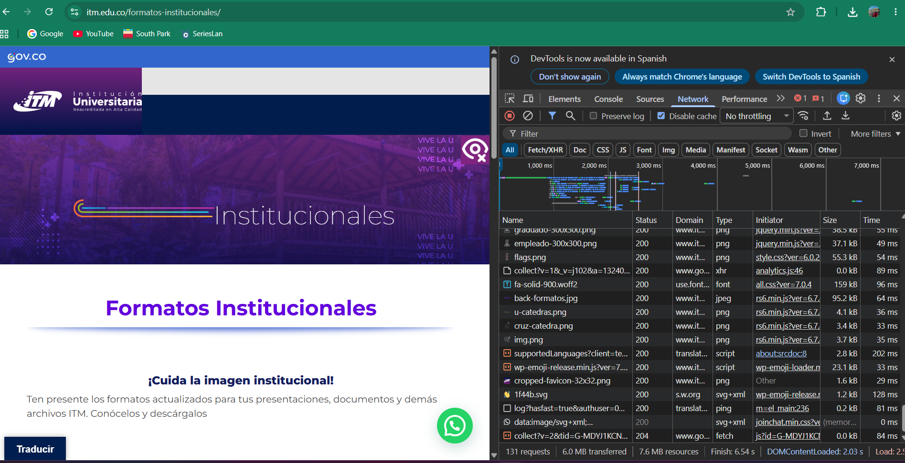
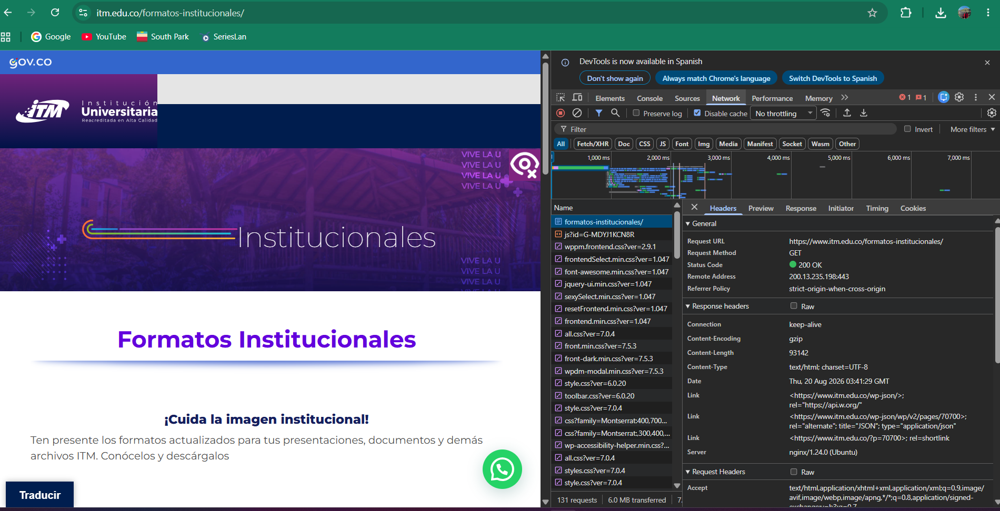
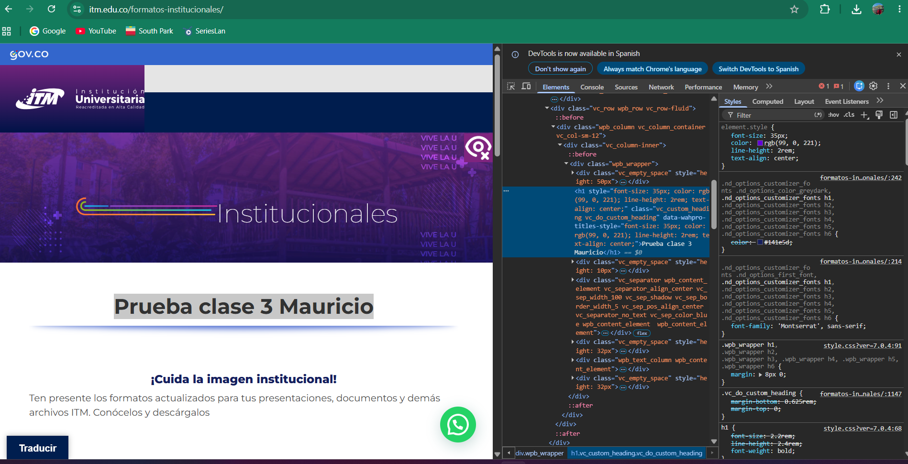
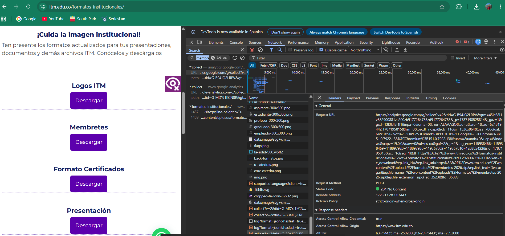
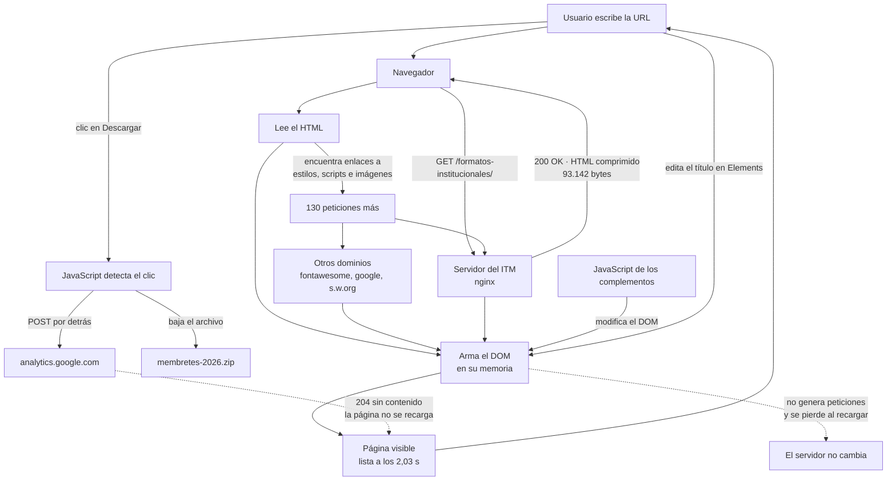

# Laboratorio 01 — Análisis del funcionamiento de una aplicación web

**Estudiante:** Mauricio Jojoa
**Curso:** Aplicaciones y Servicios Web
**Página analizada:** https://www.itm.edu.co/formatos-institucionales/
**Navegador:** Google Chrome en Windows
**Fecha:** 19 de agosto de 2026

---

## Objetivo

Analizar cómo funciona una página web real usando las herramientas de desarrollo del navegador, para entender qué recursos carga, cómo se comunica con el servidor y cómo se arma lo que uno ve en pantalla.

---

# 1. Preparación del entorno

Entré a la página de Formatos Institucionales del ITM y abrí las herramientas de desarrollo con la tecla `F12`. Las dejé acopladas al lado derecho para poder ver al mismo tiempo la página y los paneles.

Trabajé con dos paneles:

- **Network**, que muestra todo lo que el navegador le pide al servidor.
- **Elements**, que muestra el código HTML de la página.

En Network activé la casilla `Disable cache` para que los tamaños que aparecen sean los que realmente se descargaron y no archivos guardados de antes.

Dentro del repositorio creé esta estructura:

```text
laboratorio-01/
├── README.md
└── evidencias/
```

---

# 2. Identificación de recursos de la aplicación

Recargué la página completa con el panel Network abierto y me sorprendió la cantidad de cosas que se piden. Escogí seis recursos de tipos diferentes:

| Recurso | Tipo | Dominio | Tamaño |
|---|---|---|---|
| `formatos-institucionales/` | Documento HTML | www.itm.edu.co | 93.142 B |
| `fa-solid-900.woff2` | Fuente de letra | use.fontawesome.com | 159 kB |
| `back-formatos.jpg` | Imagen JPEG | www.itm.edu.co | 95,2 kB |
| `flags.png` | Imagen PNG | www.itm.edu.co | 55,3 kB |
| `wp-emoji-release.min.js` | JavaScript | www.itm.edu.co | 23,1 kB |
| `1f44b.svg` | Imagen SVG | s.w.org | 1,2 kB |

**Total de solicitudes observadas:** `131`

Abajo del panel aparece un resumen con más datos:

- **6,0 MB** transferidos por la red
- **7,6 MB** de recursos ya descomprimidos
- `DOMContentLoaded`: **2,03 s**
- `Finish`: **6,54 s**

Me llamó la atención que los 6,0 MB que viajaron por internet se convierten en 7,6 MB una vez llegan. Eso pasa porque el servidor comprime los archivos antes de enviarlos, y el navegador los descomprime. Así se ahorra más o menos 1,6 MB de datos.

Otra cosa que noté es que no todos los archivos vienen del ITM. La fuente de las letras viene de `use.fontawesome.com`, un emoji viene de `s.w.org` y hay varias peticiones que van hacia Google.

## Evidencia



En la captura se ve la lista completa de peticiones con su estado, dominio, tipo, tamaño y tiempo, y abajo el resumen de las 131 solicitudes. Esto muestra que el navegador no descarga "una página" sino muchos archivos separados. Como el sitio del ITM está hecho con un gestor de contenidos que tiene muchos complementos instalados, cada complemento trae sus propios archivos de estilos y de JavaScript, y por eso son tantos.

### Análisis

**¿Por qué una sola URL puede generar múltiples solicitudes HTTP?**

> Porque el archivo HTML que llega del servidor no trae la página terminada. Lo que trae son enlaces a los otros archivos que la componen. Cuando el navegador lee ese HTML y encuentra etiquetas como `<link>`, `<script>` o ``, tiene que hacer una petición nueva por cada una para poder mostrar la página completa.
>
> Además, en la columna `Initiator` vi que algunas peticiones no las pide el HTML sino otros archivos. Por ejemplo, la hoja de estilos `all.css` fue la que pidió la fuente `fa-solid-900.woff2`, y el archivo `rs6.min.js` fue el que pidió las imágenes del carrusel. O sea que un archivo puede pedir otros archivos, y así se va formando una cadena.

---

# 3. Análisis de una solicitud HTTP

Le di clic a la primera petición de la lista, que es la del documento principal de la página, y revisé la pestaña `Headers`.

| Elemento | Resultado |
|---|---|
| URL | https://www.itm.edu.co/formatos-institucionales/ |
| Método HTTP | `GET` |
| Código de estado | `200 OK` |
| Host / dominio | www.itm.edu.co (IP 200.13.235.198, puerto 443) |
| Tipo de recurso | Documento HTML (`text/html; charset=UTF-8`) |
| Tiempo de respuesta | `DOMContentLoaded` 2,03 s y `Finish` 6,54 s |

En la respuesta del servidor aparecen estos datos:

| Encabezado | Valor |
|---|---|
| `Server` | nginx/1.24.0 (Ubuntu) |
| `Content-Type` | text/html; charset=UTF-8 |
| `Content-Encoding` | gzip |
| `Content-Length` | 93142 |
| `Date` | Thu, 20 Aug 2026 03:41:29 GMT |

El puerto 443 significa que la conexión es por HTTPS, o sea que va cifrada.

## Evidencia



En la captura se ve la pestaña `Headers` con la dirección pedida, el método `GET`, el estado `200 OK` y la IP del servidor. Abajo están los encabezados que envía el servidor. Esto muestra que el navegador pidió un solo archivo y que el servidor le respondió bien. Este archivo es el más importante de todos porque hasta que no llegue, el navegador ni siquiera sabe qué otros archivos tiene que pedir.

### Análisis

**¿Qué recurso solicitó el navegador?**

> Pidió el archivo HTML de la página de Formatos Institucionales. El servidor lo devolvió como `text/html` y comprimido con gzip, con un tamaño de 93.142 bytes.
>
> Algo curioso es que ese archivo no está guardado en el servidor con ese nombre. En la respuesta hay unos encabezados `Link` que mencionan `wp-json/wp/v2/pages/70700` y `?p=70700`, lo que quiere decir que el servidor arma ese HTML en el momento a partir de un contenido que él identifica internamente con el número 70700. La dirección bonita que uno escribe es solo una forma más fácil de pedirlo.

**¿Qué información permite determinar si la solicitud fue atendida correctamente?**

> Lo primero que hay que mirar es el código de estado. El `200 OK` quiere decir que el servidor entendió la petición y devolvió lo que se le pidió. Si saliera un `404` sería que la página no existe, y si saliera un `500` sería que el servidor tuvo un error.
>
> Pero solo con el código no basta. También revisé que el `Content-Type` fuera `text/html`, para confirmar que lo que llegó es de verdad una página y no otra cosa, y que el `Content-Length` coincidiera con lo que se descargó, para saber que llegó completa. Además vi que el evento `DOMContentLoaded` se registró a los 2,03 segundos, lo que confirma que el navegador sí logró armar la página.
>
> Hay que tener cuidado porque una página puede responder `200 OK` y aun así mostrar un mensaje de error en la pantalla. El código dice que la comunicación salió bien, no que el contenido sea el correcto.

---

# 4. Inspección del DOM

**Elemento seleccionado:** el título principal de la página

**Etiqueta HTML:** `<h1 class="vc_custom_heading vc_do_custom_heading">`

**Contenido original:** `Formatos Institucionales`

**Modificación realizada:** `Prueba clase 3 Mauricio`

Le di clic derecho sobre el título grande morado que dice "Formatos Institucionales" y elegí "Inspeccionar". El panel Elements me llevó directo a la etiqueta `<h1>`. Le di doble clic al texto, lo borré, escribí "Prueba clase 3 Mauricio" y le di Enter. El título cambió de una vez en la pantalla.

Mientras estaba ahí noté algo que no esperaba. En el panel `Styles` de la derecha aparece un bloque `element.style` que dice `font-size: 35px`, pero también aparece una regla del archivo `style.css` que dice `font-size: 2.2rem` y está **tachada**. Las reglas tachadas son las que el navegador decidió no aplicar porque otra tiene más prioridad.

Investigando un poco más, el HTML que envía el servidor trae `2.2rem`, no `35px`. El cambio a `35px` y un atributo raro llamado `data-wahpro-titles-style` se los pone un complemento de accesibilidad que tiene instalado el sitio, mientras la página se está cargando. O sea que el código que uno ve en el panel Elements ya no es exactamente el que mandó el servidor.

## Evidencia



En la captura se ve al lado izquierdo el título de la página ya cambiado a "Prueba clase 3 Mauricio", y al lado derecho la etiqueta `<h1>` seleccionada en el panel Elements con ese mismo texto. El cambio se vio de inmediato y no hizo falta recargar nada. Esto muestra que lo que uno ve en pantalla no es el archivo del servidor sino una versión que el navegador arma y guarda en su propia memoria.

### Análisis

**¿La modificación realizada sobre el DOM alteró permanentemente la aplicación o los archivos almacenados en el servidor? Justifique.**

> No. El cambio solo existió en mi computador y desapareció apenas recargué la página.
>
> Lo que pasa es que el navegador no recibe el contenido original, sino una copia. Con esa copia arma en su memoria una estructura llamada DOM, y es sobre esa estructura que trabajan las herramientas de desarrollo. El servidor ni se entera.
>
> Tres cosas me lo confirmaron:
>
> 1. Mientras editaba el título, en el panel Network **no apareció ninguna petición nueva**. Si el cambio hubiera viajado al servidor, tendría que haberse visto alguna solicitud, y no hubo ninguna.
> 2. Al volver a cargar la página, el servidor siguió mandando "Formatos Institucionales". Mi texto no aparece por ningún lado.
> 3. Con solo apretar `F5` el título volvió a la normalidad.
>
> Además, para cambiar algo de verdad habría que estar autenticado, porque un servidor no acepta que cualquier persona le modifique el contenido. Las herramientas de desarrollo no se saltan ese control, simplemente no lo tocan.
>
> Esto sirve para probar cosas, por ejemplo para ver cómo se vería un título más largo antes de pedir el cambio. Pero no sirve para modificar una página ajena, porque nadie más lo ve.

---

# 5. Análisis de una interacción dinámica

Limpié el panel Network con el botón de la 🚫 y después le di clic al botón **Descargar** de la sección "Membretes".

| Elemento | Resultado |
|---|---|
| Acción realizada | Clic en el botón `Descargar` de Membretes |
| ¿Generó una nueva solicitud? | **Sí** |
| URL solicitada | https://analytics.google.com/g/collect?... |
| Método HTTP | `POST` |
| Código de estado | `204 No Content` |
| Tipo de respuesta | Sin contenido (0,0 kB) |

Lo interesante fue revisar la dirección completa de esa petición, porque lleva un montón de información metida ahí:

| Dato que viajó | Valor |
|---|---|
| Nombre del evento | `file_download` |
| Archivo descargado | `/wp-content/uploads/formatos/membretes-2026.zip` |
| Texto del botón | `Descargar` |
| Página desde donde se hizo clic | `https://www.itm.edu.co/formatos-institucionales/` |
| Resolución de mi pantalla | `1536x864` |
| Idioma de mi navegador | `es-co` |
| Mi sistema operativo | `Windows` |

El código `204 No Content` quiere decir que el servidor recibió todo bien pero no devuelve nada de vuelta. Tiene sentido, porque el navegador no necesitaba una respuesta, solo quería avisar que yo había descargado un archivo.

Y sí, el archivo se descargó: el `membretes-2026.zip` quedó en mi carpeta de descargas con 330.024 bytes. O sea que un solo clic hizo dos cosas al mismo tiempo: bajar el archivo del servidor del ITM y avisarle a Google lo que yo acababa de hacer.

## Evidencia



En la captura se ve la petición `collect` hacia `analytics.google.com` seleccionada, con su método `POST`, el estado `204 No Content` y la dirección completa donde aparece el evento `file_download` y el nombre del archivo. Esto muestra que una acción tan sencilla como bajar un archivo genera tráfico hacia un sitio de terceros que uno nunca escogió, y que la página no avisa nada de eso.

### Análisis

**Explique la relación entre la acción realizada por el usuario y la solicitud observada.**

> El clic fue la causa directa de la petición, pero no de la forma que uno se imaginaría.
>
> El botón "Descargar" es un enlace hacia el archivo `membretes-2026.zip`. Antes de que ese enlace se abriera, un JavaScript de la página alcanzó a interceptar el clic. Lo sé porque en la petición viajan datos como el texto del botón (`Descargar`) y la dirección del archivo, y eso solo se puede saber leyendo el elemento HTML sobre el que uno hizo clic. Ningún servidor podría adivinarlo.
>
> Ese JavaScript armó un evento llamado `file_download`, le metió toda esa información y lo mandó con `POST` a Google, que respondió `204` para decir que lo recibió.
>
> Lo más importante de todo esto es que la petición fue **asíncrona**, es decir que pasó por detrás sin interrumpir nada:
>
> - la página no se recargó,
> - la dirección de la barra no cambió,
> - la pantalla no se movió,
> - yo no me di cuenta de nada.
>
> Esa es justamente la diferencia entre una página web moderna y una antigua. Antes, cualquier interacción obligaba a recargar la página entera. Ahora el JavaScript puede hablar con un servidor por detrás mientras uno sigue usando la página normalmente. Aquí se usa para llevar estadísticas, pero es el mismo mecanismo que sirve para guardar un formulario sin recargar o para cargar más resultados cuando uno baja con el mouse.

---

# 6. Reconstrucción del flujo observado

Este diagrama lo armé con lo que yo mismo pude comprobar durante la práctica:



Las flechas continuas son el camino normal de la página. Las punteadas son los dos casos raros que encontré: una acción que no genera ninguna petición y que se pierde al recargar (editar el DOM), y otra que sí genera una petición pero sin que la página se mueva (la descarga).

---

# 7. Observado vs. inferido

## Elementos observados directamente

- Las 131 peticiones de la carga, con su tamaño, tiempo, dominio y código de estado.
- Que se transfirieron 6,0 MB y que los recursos pesan 7,6 MB ya descomprimidos.
- Que el servidor es `nginx/1.24.0 (Ubuntu)`, que su IP es `200.13.235.198` y que responde por el puerto 443, porque él mismo lo dice en sus encabezados.
- Que el documento principal se pidió con `GET` y respondió `200 OK` con 93.142 bytes.
- Que el título de la página es una etiqueta `<h1>` y que al cambiarla no se generó ninguna petición.
- Que el DOM no es igual al HTML original, porque el `font-size` es distinto y hay un atributo `data-wahpro-titles-style` que el servidor no envía.
- Que al hacer clic en Descargar se envió un `POST` a `analytics.google.com` que respondió `204`, y toda la información que iba dentro de esa petición.
- Que el archivo `membretes-2026.zip` quedó descargado en mi computador.

## Elementos inferidos

- **Que el sitio está hecho en WordPress.** El servidor no lo dice en ninguna parte. Yo lo deduzco porque las direcciones de los archivos tienen `wp-content`, `wp-includes` y `wp-json`. Es bastante probable, pero no lo puedo comprobar.
- **Que un JavaScript de la página interceptó el clic.** Lo que yo vi fue el resultado, no el código que lo hace.
- **Cómo hace el servidor para armar el HTML.** Sé que lo arma en el momento porque los encabezados `Link` mencionan el número 70700, pero el programa que lo genera nunca llega al navegador.
- **Qué hay detrás de esa IP.** Puede ser un servidor solo o varios trabajando juntos, desde el navegador no hay forma de saberlo.
- **Por qué el `Finish` (6,54 s) es tan superior al `DOMContentLoaded` (2,03 s).** Se ve la diferencia, pero no si es por la velocidad de mi internet, por el servidor o por los archivos de terceros.
- **Qué hace Google con la información que recibió.** Se ve exactamente qué salió de mi navegador, pero de ahí en adelante no hay manera de saber nada.

Ninguno de los procesos internos del servidor lo puse como observado, porque las herramientas del navegador solo dejan ver lo que pasa por la red y lo que ocurre dentro del navegador. Todo lo demás son suposiciones a partir de pistas.

---

# 8. Conclusiones

1. **Una dirección web no es una página, es apenas el comienzo.** Yo escribí una sola URL y el navegador terminó haciendo 131 peticiones y bajando 6,0 MB. Lo que más me sorprendió es que varios de esos archivos ni siquiera son del ITM: la fuente de las letras viene de `use.fontawesome.com` y un emoji viene de `s.w.org`. Eso significa que si alguno de esos sitios ajenos se cae o se pone lento, la página del ITM se ve afectada aunque su propio servidor esté funcionando perfectamente.

2. **Lo que uno ve en pantalla no es el archivo del servidor.** Cuando cambié el título desde las herramientas de desarrollo, se modificó al instante y sin generar ni una sola petición, pero el servidor siguió mandando el texto original. Y todavía más raro: el código ya era distinto antes de que yo lo tocara, porque un complemento del sitio le había cambiado el tamaño de letra mientras la página cargaba. Entendí que para que un cambio sea permanente tiene que existir una petición que lo lleve hasta el servidor, y si esa petición no aparece en Network, el cambio no salió del computador.

3. **Las páginas hacen cosas por detrás que uno no alcanza a notar.** Le di clic a un botón para bajar un archivo y, sin que la página se moviera ni cambiara la dirección, se envió a Google el nombre del archivo, el texto del botón, la resolución de mi pantalla, mi idioma y mi sistema operativo. Técnicamente es el mecanismo que hace posibles las páginas modernas, pero también me hizo caer en cuenta de que una acción tan simple genera tráfico hacia sitios que uno nunca escogió. Sin abrir las herramientas de desarrollo jamás me habría enterado.

---

# 9. Entrega

```text
laboratorio-01/
├── README.md
└── evidencias/
    ├── network.png
    ├── request.png
    ├── dom.png
    └── interaccion.png
```

- [x] El `README.md` se visualiza correctamente en GitHub.
- [x] Las imágenes se muestran dentro del README.
- [x] Se documentaron al menos cinco recursos.
- [x] Se analizó una solicitud HTTP.
- [x] Se identificó y modificó un elemento del DOM.
- [x] Se analizó una interacción de la aplicación.
- [x] El diagrama final corresponde a lo observado.
- [x] Se diferenciaron elementos observados e inferidos.
- [x] Se redactaron tres conclusiones técnicas.
- [x] Se realizó `commit` y `push` al repositorio.
